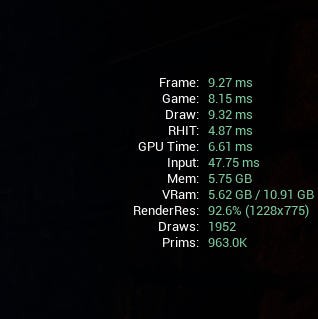
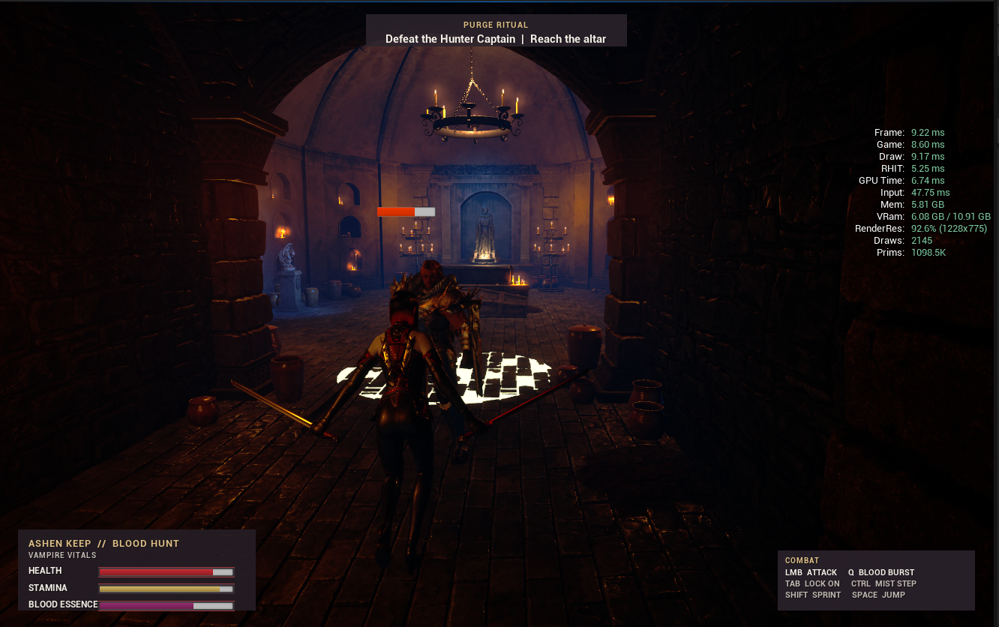
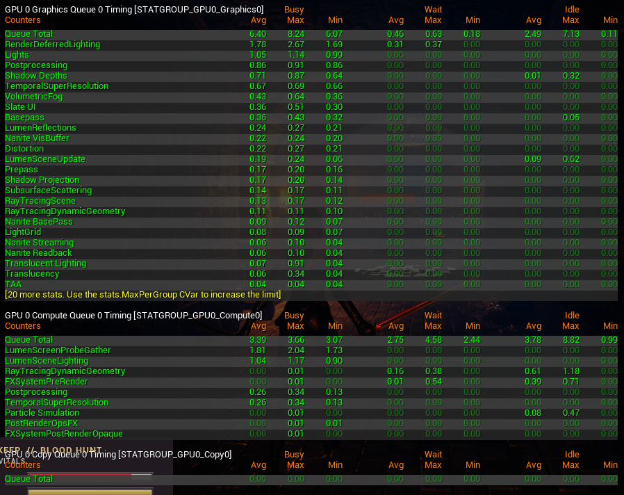
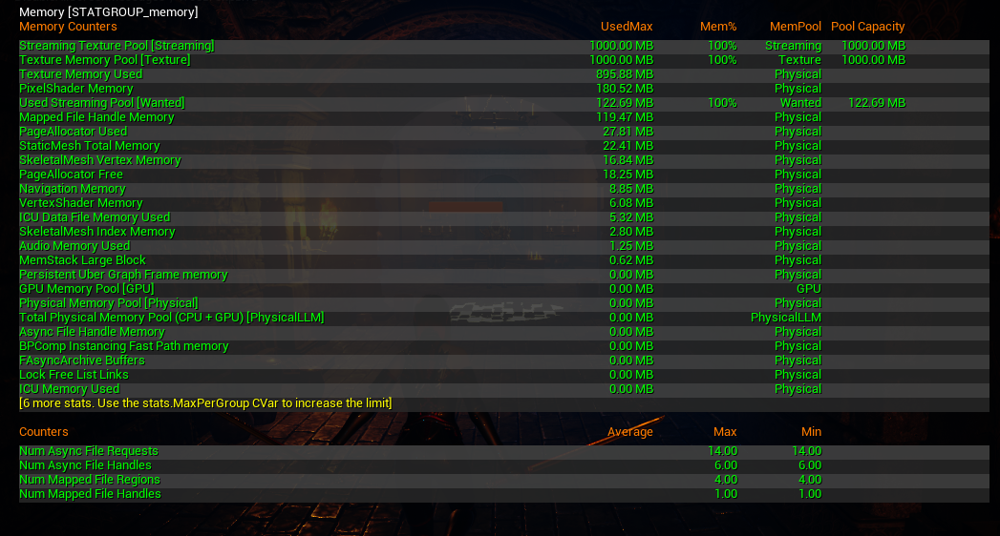

# Performance Profiling

## Scope

These measurements were captured in Unreal Engine 5.8 using Standalone Game at approximately 1228 x 775 on Windows.

Test machine:

- Intel Core i7-13700F
- NVIDIA GeForce RTX 5070 12 GB
- 32 GB system memory

The values below are measured profiling snapshots from one machine. They are not presented as cross-hardware benchmarks or multi-run statistical averages.

## Heavy Environment Scene

| Metric | Value |
|---|---:|
| Frame time | 9.27 ms |
| Estimated frame rate | approximately 108 FPS |
| Game Thread | 8.15 ms |
| Draw Thread | 9.32 ms |
| RHI Thread | 4.87 ms |
| GPU time | 6.61 ms |
| Draw calls | 1,952 |
| Rendered primitives | 963.0K |
| Process memory | 5.75 GB |
| Reported VRAM usage | 5.62 / 10.91 GB |

## Hunter Captain Combat

| Metric | Value |
|---|---:|
| Frame time | 9.22 ms |
| Estimated frame rate | approximately 108 FPS |
| Game Thread | 8.60 ms |
| Draw Thread | 9.17 ms |
| RHI Thread | 5.25 ms |
| GPU time | 6.74 ms |
| Draw calls | 2,145 |
| Rendered primitives | 1,098.5K |
| Process memory | 5.81 GB |
| Reported VRAM usage | 6.08 / 10.91 GB |

The boss encounter increased visible geometry and draw calls, but frame time remained almost unchanged. AI, animation, HUD and combat effects did not create a large frame-time spike in the captured encounter.

## GPU Breakdown

Graphics Queue timing:

| Metric | Value |
|---|---:|
| Average | 6.40 ms |
| Maximum | 8.24 ms |
| Minimum | 6.07 ms |

Largest graphics passes:

| Pass | Average |
|---|---:|
| Deferred Lighting | 1.70 ms |
| Lights | 1.05 ms |
| Post Processing | 0.86 ms |
| Shadow Depths | 0.71 ms |
| Temporal Super Resolution | 0.67 ms |
| Volumetric Fog | 0.43 ms |
| Slate UI | 0.36 ms |
| Base Pass | 0.36 ms |
| Lumen Reflections | 0.24 ms |
| Nanite VisBuffer | 0.22 ms |

Largest asynchronous compute passes included Lumen Screen Probe Gather at 1.81 ms and Lumen Scene Lighting at 1.04 ms. Compute timings are not added directly to the graphics total because the queues can overlap.

## Memory Snapshot

| Category | Used |
|---|---:|
| Texture memory | 895.88 MB |
| Texture pool capacity | 1000 MB |
| Texture pool utilization | approximately 89.6% |
| Wanted streaming memory | 122.69 MB |
| Pixel shader memory | 180.52 MB |
| Mapped file handle memory | 119.47 MB |
| Page allocator | 27.81 MB |
| Static mesh memory | 22.41 MB |
| Skeletal mesh vertex memory | 16.84 MB |
| Navigation memory | 8.85 MB |
| Vertex shader memory | 6.08 MB |
| Skeletal mesh index memory | 2.80 MB |
| Audio memory | 1.25 MB |

The texture pool was not over budget in the captured scene, but it had limited remaining headroom.

## Bottleneck Analysis

The Draw Thread was the longest major frame component in both captures:

- heavy environment: 9.32 ms Draw versus 6.61 ms GPU;
- boss combat: 9.17 ms Draw versus 6.74 ms GPU.

This indicates that the captured scene was primarily limited by CPU-side render preparation rather than raw GPU execution.

Likely contributors include:

- approximately 2,000 draw calls;
- close to one million or more rendered primitives;
- many separate dungeon props;
- dynamic lights and shadow-casting lights;
- skeletal enemies and combat animation;
- Lumen, Nanite, fog and fire effects.

## Optimization Plan

Potential next steps, ordered by likely value:

1. convert repeated candles, pottery and dungeon props to ISM or HISM;
2. reduce unnecessary shadow casting on small decorative lights;
3. limit the number and radius of simultaneous shadow-casting lights;
4. validate cull distances for small props;
5. review LOD and Nanite settings for repeated architecture;
6. inspect Blueprint and Actor Tick usage;
7. reduce selected 4K textures to 2K where visual impact is minimal.

## Engineering Conclusion

- The heavy scene and boss encounter both stayed near 9.2 ms frame time.
- The project maintained substantial headroom relative to the 16.67 ms budget for 60 FPS.
- The boss encounter remained stable despite higher draw calls and geometry.
- The principal optimization opportunity is Draw Thread cost.
- Texture usage stayed inside the configured pool but should be monitored as the level grows.